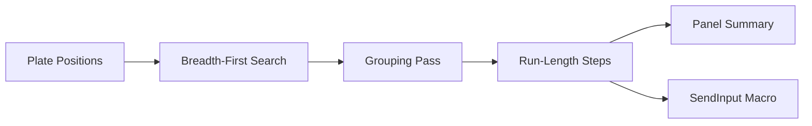

<!-- lang -->

[](README.tr.md)

<p align="center"></p>

# Gothic 1 LockPicker

Lock-pick solver overlay.

## Numbers

| Measure | Value |
| --- | --- |
| Solver tests passing (`npm run test`) | 14 / 14 |
| Plate offset range per plate | −4 … +4 |
| BFS state budget | `MAX_BFS_STATES` in `src/LockSolver.ts` |

## What It Is

A transparent Electron window that sits on top of Gothic 1 (Remake). You enter each plate's position and how every move shifts the other plates. The app finds the shortest move sequence and groups it so you switch move type as rarely as possible. It can then press the keys for you. It is Windows only.

## Can't I Just Solve It By Hand?

You can. The minigame is a small puzzle and trial and error works. What this adds:

- **Shortest path.** A breadth-first search over every reachable plate state, not a guess.
- **Fewer switches.** A second pass reorders the same moves so each move type runs in one block.
- **Hands-free playback.** Scancode keystrokes through `SendInput`, which DirectInput games actually read.
- **Stays out of the way.** Click-through everywhere except the panel and its corner button.

## Features

- **Overlay panel.** Opens with `F9`, `F10`, `Ctrl+Space` or `Alt+Z`, even while the game has focus.
- **Solver.** BFS plus a grouping pass, both with a budget so a 12-plate lock cannot freeze the UI.
- **Auto-solve.** Replays the solution with tunable hold time and delay between keys.
- **Emergency stop.** `Alt+X` or `F8` kills the macro and releases every key it may have held.
- **Auto mode.** Shows the corner button only while a chosen lock-screen corner is on screen.
- **Passive mode.** Hides the corner button until the cursor is over that corner.

## What It Does Not Do

- It does not read plate positions from the screen. You enter them.
- It does not draw over a game in exclusive fullscreen. Use windowed or borderless mode (`zStartupWindowed` in `Gothic.ini`).
- It does not open the panel on its own. Auto mode only shows or hides the button.
- It does not run on macOS or Linux.

## Installation

Windows 10 or 11, x64.

**With Teknesyum Base.** Pick **Gothic 1 LockPicker** from the list and press install.

**With the installer.** From the [latest release](https://github.com/Teknesyum/Gothic-1-Remake-Picklocker/releases/latest), download `Kur.zip`, unzip it and double-click `Kur.bat`. It downloads `Gothic1LockPicker-win-x64.zip` with its `.sha256` file and refuses to install if the checksum does not match. The program goes to `%LOCALAPPDATA%\Programs\Gothic 1 LockPicker`, so no admin rights are needed, and gets a desktop and a Start menu shortcut.

**By hand.** Download `Gothic1LockPicker-win-x64.zip` from the release page, check it against the `.sha256` next to it, unzip and run `Gothic1LockPicker.exe`. The exe is not code-signed yet, so SmartScreen may warn on first launch.

When a newer release is out, an **Update** badge appears in the panel header. Nothing is downloaded until you press it, and the app restarts only when you press **Install**. There is no macOS or Linux build and no Claude Code plugin.

## How It Works

The lock is a vector of plate offsets. Each move is a row in the moves matrix, applied with direction +1 or −1. A breadth-first search walks states until every plate is at zero.

Breadth-first order does not care how often the move type changes, and changing type is the slow action in game. A memoised search reorders the same multiset of moves to minimise the number of groups. If that search runs out of budget, the plain BFS order is used; it is still a valid solution.



The diagram reads left to right: plate positions go into the breadth-first search, the grouping pass reorders the result, it is compressed into run-length steps, and those steps feed both the panel summary and the keystroke macro.

## The Program Shows What It Does

| Surface | What it tells you |
| --- | --- |
| Solution summary | Each step with its move and repeat count before anything is pressed. |
| Macro progress | Which step is being pressed right now, and a stop button. |
| Focus warning | Whether the game window could be brought to the front before playback. |
| Update badge and panel | That a newer release exists, download progress, the SHA-256 check, and that nothing is installed until you press Install. |

## Development

```bash
npm install
```

```bash
npm run electron:dev
```

```bash
npm run test
```

```bash
npm run lint
```

```bash
npm run dist
```

```bash
npm run icon
```

`electron:dev` starts Vite and Electron together. `dist` builds `Gothic1LockPicker-win-x64.zip`, its `.sha256` and `Kur.zip` into `release/`. `icon` rebuilds `assets/icon.ico` and the PNGs from `assets/icon.svg` and `assets/icon-small.svg`.

UI colours, radii and durations come from the generated tokens in `teknesyum-ui/`. Architecture notes and the bugs they prevent are in [docs/architecture.md](docs/architecture.md).

## Contributing

Open an issue before a pull request. Keep pull requests small and focused on one change. Repository text is English. Contributions are accepted under the project license; sign-off rules are in [CONTRIBUTING.md](CONTRIBUTING.md). If the tool saves you time, sponsoring Teknesyum keeps it maintained.

## Changelog

See [CHANGELOG.md](CHANGELOG.md) for release history.

## License

AGPL-3.0-or-later. See [LICENSE](LICENSE).

<!-- signature -->
<div align="center">

<a href="https://github.com/sponsors/Teknesyum"></a>
&nbsp;
<a href="LICENSE"></a>

</div>
