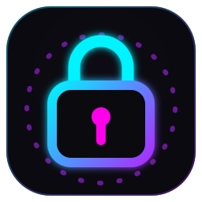
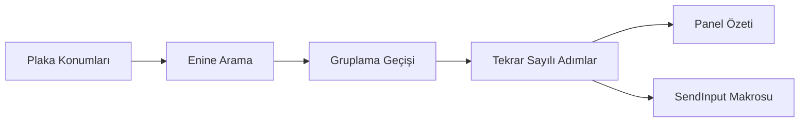

<!-- lang -->

[](README.md)

<p align="center"></p>

# Gothic 1 LockPicker

Kilit açma çözücü katmanı.

## Sayılar

| Ölçü | Değer |
| --- | --- |
| Geçen çözücü testi (`npm run test`) | 14 / 14 |
| Plaka başına konum aralığı | −4 … +4 |
| BFS durum bütçesi | `src/LockSolver.ts` içinde `MAX_BFS_STATES` |

## Nedir

Gothic 1 (Remake) üstünde duran saydam bir Electron penceresidir. Her plakanın konumunu ve her hamlenin diğer plakaları nasıl kaydırdığını girersin. Uygulama en kısa hamle dizisini bulur ve hamle türünü olabildiğince az değiştirecek şekilde gruplar. İstersen tuşlara senin yerine basar. Yalnız Windows'ta çalışır.

## Elle Çözemez Miyim?

Çözebilirsin. Mini oyun küçük bir bulmaca, deneme yanılma işe yarar. Bunun eklediği:

- **En kısa yol.** Ulaşılabilir her plaka durumu üzerinde enine arama; tahmin değil.
- **Daha az geçiş.** İkinci geçiş aynı hamleleri yeniden sıralar, her hamle türü tek blokta kalır.
- **Eller serbest oynatma.** `SendInput` ile tarama kodu tuş basışları; DirectInput kullanan oyunlar bunları gerçekten okur.
- **Yolunda durmaz.** Panel ve köşe düğmesi dışında her yerde tıklama oyuna geçer.

## Özellikler

- **Katman paneli.** Oyun odaktayken bile `F9`, `F10`, `Ctrl+Space` ya da `Alt+Z` ile açılır.
- **Çözücü.** BFS ve gruplama geçişi; ikisinin de bütçesi var, 12 plakalı bir kilit arayüzü donduramaz.
- **Otomatik çözüm.** Çözümü ayarlanabilir basılı tutma süresi ve tuş arası gecikmeyle oynatır.
- **Acil durdurma.** `Alt+X` ya da `F8` makroyu keser ve basılı kalmış olabilecek her tuşu bırakır.
- **Otomatik mod.** Köşe düğmesini yalnız seçilen kilit ekranı köşesi ekrandayken gösterir.
- **Pasif mod.** İmleç o köşeye gelene kadar köşe düğmesini gizler.

## Yapmadıkları

- Plaka konumlarını ekrandan okumaz. Sen girersin.
- Özel tam ekran kipindeki oyunun üstüne çizemez. Pencereli ya da kenarlıksız kip kullan (`Gothic.ini` içinde `zStartupWindowed`).
- Paneli kendiliğinden açmaz. Otomatik mod yalnız düğmeyi gösterir ya da gizler.
- macOS ve Linux'ta çalışmaz.

## Kurulum

Windows, PowerShell içinde:

```powershell
irm https://raw.githubusercontent.com/Teknesyum/Gothic-1-Remake-Picklocker/v1.2/install.ps1 | iex
```

Gerekenler: [Git](https://git-scm.com/downloads) ve [Node.js](https://nodejs.org). Betik depoyu `%LOCALAPPDATA%\Gothic1LockPicker` altına klonlar, `npm install` çalıştırır ve masaüstüne `Gothic 1 LockPicker.bat` koyar.

Uygulama her açılışta kendi kopyasını `origin/master` ile karşılaştırır ve güncellemeden önce sorar. macOS ya da Linux kurulumu ve Claude Code eklentisi yoktur.

## Nasıl Çalışır

Kilit, plaka konumlarından oluşan bir vektördür. Her hamle hamle matrisinde bir satırdır ve +1 ya da −1 yönüyle uygulanır. Enine arama, bütün plakalar sıfıra gelene kadar durumları gezer.

Enine arama sırası, hamle türünün ne sıklıkla değiştiğine bakmaz; oyunda yavaş olan eylem de tür değiştirmektir. Belleklenmiş bir arama aynı hamle kümesini grup sayısı en az olacak şekilde yeniden sıralar. Bu aramanın bütçesi biterse düz BFS sırası kullanılır; o da geçerli bir çözümdür.



Diyagram soldan sağa okunur: plaka konumları enine aramaya girer, gruplama geçişi sonucu yeniden sıralar, sonuç tekrar sayılı adımlara sıkıştırılır ve bu adımlar hem panel özetini hem tuş makrosunu besler.

## Program Ne Yaptığını Gösterir

| Yüzey | Ne söyler |
| --- | --- |
| Çözüm özeti | Hiçbir tuşa basılmadan önce her adım, hamlesi ve tekrar sayısıyla. |
| Makro ilerlemesi | Şu an hangi adıma basıldığı ve bir durdurma düğmesi. |
| Odak uyarısı | Oynatmadan önce oyun penceresinin öne getirilip getirilemediği. |
| Güncelleme sorusu | Yeni sürüm olduğu ve sen kabul etmeden hiçbir şeyin değişmediği. |

## Geliştirme

```bash
npm install
```

```bash
npm run electron:dev
```

```bash
npm run test
```

```bash
npm run lint
```

```bash
npm run dist
```

```bash
npm run icon
```

`electron:dev` Vite ile Electron'u birlikte başlatır. `dist` taşınabilir exe'yi `release/` altına derler. `icon`, `assets/icon.svg` ve `assets/icon-small.svg` dosyalarından `assets/icon.ico` ile PNG'leri yeniden üretir.

Arayüz renkleri, yarıçaplar ve süreler `teknesyum-ui/` altındaki üretilmiş token'lardan gelir. Mimari notlar ve önledikleri hatalar [docs/architecture.md](docs/architecture.md) içinde.

## Katkı

Çekme isteğinden önce bir issue aç. Çekme isteklerini küçük ve tek değişikliğe odaklı tut. Depo metni İngilizcedir. Katkılar projenin lisansı altında kabul edilir; imza kuralları [CONTRIBUTING.md](CONTRIBUTING.md) içinde. Araç sana zaman kazandırıyorsa Teknesyum'a sponsor olmak bakımını sürdürür.

## Değişiklik Günlüğü

Sürüm geçmişi [CHANGELOG.md](CHANGELOG.md) içinde.

## Lisans

AGPL-3.0-or-later. Bkz. [LICENSE](LICENSE).

<!-- signature -->
<div align="center">

<a href="https://github.com/sponsors/Teknesyum"></a>
&nbsp;
<a href="LICENSE"></a>

</div>
